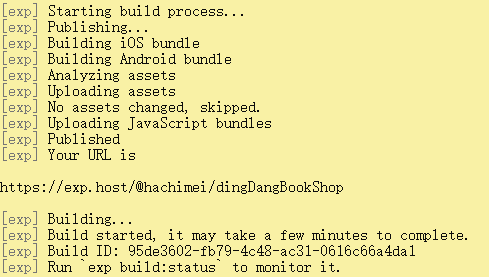

此处记录expo打包apk遇到的坑
-----------------
* There was an error publishing your project. Please check for any warnings.
  

解决方法：[参考expo论坛的帖子](https://forums.expo.io/t/android-build-in-progress-after-one-day/1811)

1. 查看自己的exp版本：exp --version

2. 更新exp版本：npm upgrade exp

3. 再次重复1的操作，如果有更新版本的话，一般就可以成功build了

4. 运行exp build:android

5. 成功上传。总之，很神奇。

    